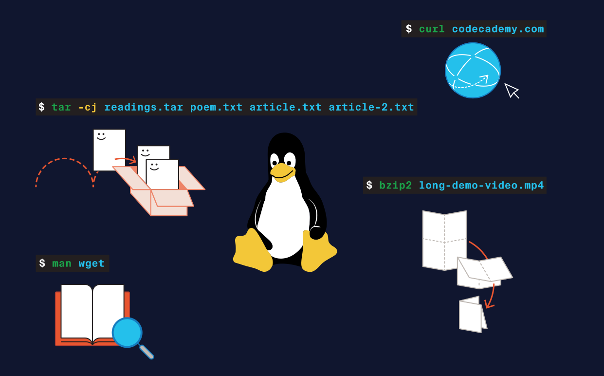

link to lesson:

https://www.codecademy.com/courses/introduction-to-linux-bash-scripting/informationals/linux-bash-utilities

Linux Bash Utilities
Learn about useful Linux Bash utilities!

The Linux shell language, called Bash, gives us a world of possibilities in interacting with the operating system. We also have the ability to compress files, archive, and extract them, all from the ease of the command line! We even have useful functions to look up documentation for all commands.

Note that we go through command line basics in a separate course, so if you’d like to take a look at our Learn the Command Line course first to practice basic navigation and filesystem modifications in Bash, we recommend doing so!

In this upcoming session, we’ll have a lesson, quiz, and off-platform project so you can put these commands to the test!

